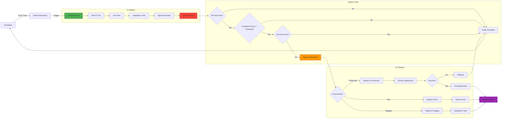
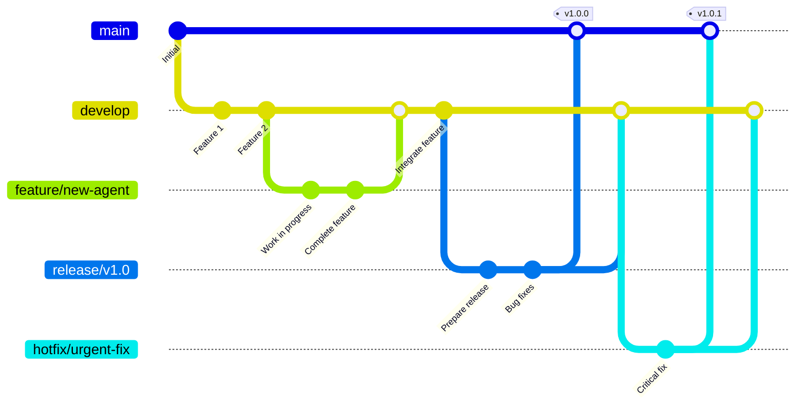
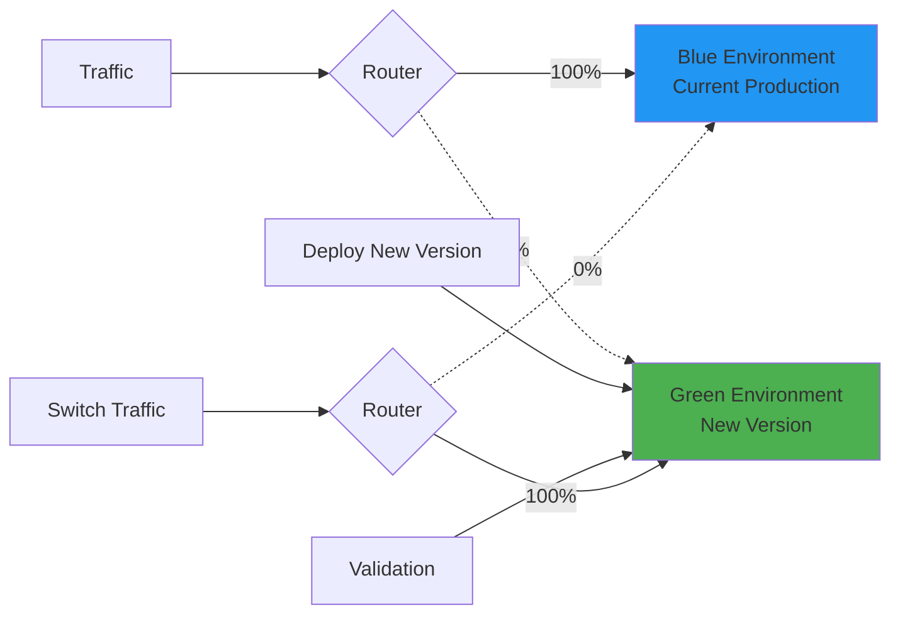
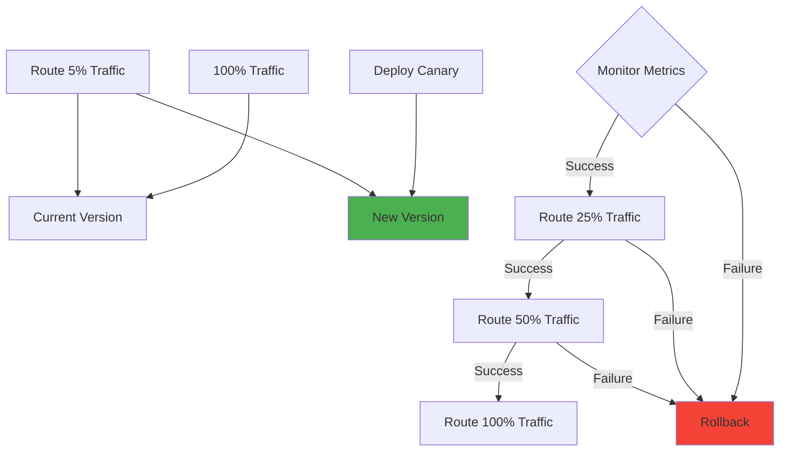

# CI/CD Deployment Guide for Agentic AI Applications

## Table of Contents
- [Overview](#overview)
- [CI/CD Architecture](#cicd-architecture)
- [Prerequisites](#prerequisites)
- [Step 1: Repository Setup](#step-1-repository-setup)
- [Step 2: GitHub Secrets Configuration](#step-2-github-secrets-configuration)
- [Step 3: GitHub Actions Workflow](#step-3-github-actions-workflow)
- [Step 4: Multi-Environment Setup](#step-4-multi-environment-setup)
- [Step 5: Automated Testing](#step-5-automated-testing)
- [Step 6: Deployment Strategies](#step-6-deployment-strategies)
- [Step 7: Monitoring and Observability](#step-7-monitoring-and-observability)
- [Best Practices](#best-practices)
- [Troubleshooting](#troubleshooting)

## Overview

This guide provides a comprehensive end-to-end CI/CD pipeline for deploying Agentic AI applications built with Azure AI Agent Framework. The pipeline automates testing, evaluation, security scanning, and deployment across multiple environments.

### Key Features
- ✅ **Automated Testing**: Agent execution, evaluation, and red team testing
- ✅ **Multi-Environment Support**: Dev, Staging, and Production environments
- ✅ **Security Scanning**: PyRIT integration for AI safety testing
- ✅ **Quality Gates**: Automated evaluation metrics and thresholds
- ✅ **Rollback Capabilities**: Safe deployment with automatic rollback
- ✅ **Monitoring**: Application Insights integration for observability

## CI/CD Architecture

The CI/CD pipeline follows a GitOps approach with automated quality gates:



## Prerequisites

Before setting up CI/CD, ensure you have:

### Azure Resources
- ✅ Azure subscription with required permissions
- ✅ Azure AI Projects (one per environment)
- ✅ Azure OpenAI Service deployments
- ✅ Azure AI Search indices
- ✅ Application Insights instances
- ✅ Azure Key Vault for secrets

### GitHub Setup
- ✅ GitHub repository for your code
- ✅ GitHub Actions enabled
- ✅ Appropriate repository permissions
- ✅ Branch protection rules configured

### Service Principal
- ✅ Azure AD Service Principal with Contributor role
- ✅ Federated credentials for OIDC authentication (recommended)
- ✅ Access to all required Azure resources

## Step 1: Repository Setup

### 1.1 Repository Structure

Organize your repository with a clear structure:

```
repository/
├── .github/
│   └── workflows/
│       ├── ci.yml                          # Continuous Integration
│       ├── cd-dev.yml                      # Deploy to Dev
│       ├── cd-staging.yml                  # Deploy to Staging
│       ├── cd-production.yml               # Deploy to Production
│       └── agent-consumption-single-env.yml # Existing workflow
├── agents/
│   ├── rfpagent/
│   │   ├── __init__.py
│   │   ├── config.py
│   │   └── tools.py
│   └── shared/
│       └── utils.py
├── tests/
│   ├── unit/
│   ├── integration/
│   └── evaluation/
│       ├── test_data.jsonl
│       └── ground_truth.jsonl
├── scripts/
│   ├── deploy.sh
│   └── rollback.sh
├── exagent.py
├── agenteval.py
├── batchevalagent.py
├── redteam.py
├── requirements.txt
└── README.md
```

### 1.2 Branch Strategy

Implement a GitFlow-inspired branching model:



**Branches:**
- `main`: Production-ready code
- `develop`: Integration branch for features
- `feature/*`: New features and enhancements
- `release/*`: Release preparation and testing
- `hotfix/*`: Critical production fixes

### 1.3 Branch Protection Rules

Configure branch protection for `main` and `develop`:

```yaml
# .github/branch-protection.yml (via GitHub API or UI)
branches:
  main:
    required_pull_request_reviews:
      required_approving_review_count: 2
      dismiss_stale_reviews: true
      require_code_owner_reviews: true
    required_status_checks:
      strict: true
      contexts:
        - "ci/tests"
        - "ci/evaluation"
        - "ci/security-scan"
    enforce_admins: true
    required_linear_history: true
    
  develop:
    required_pull_request_reviews:
      required_approving_review_count: 1
    required_status_checks:
      strict: true
      contexts:
        - "ci/tests"
```

## Step 2: GitHub Secrets Configuration

### 2.1 Create Azure Service Principal

#### Option 1: Using OIDC (Recommended)

```bash
# Variables
APP_NAME="github-actions-agentic-ai"
SUBSCRIPTION_ID=$(az account show --query id -o tsv)
RESOURCE_GROUP="rg-rfp-agent-prod"

# Create App Registration
APP_ID=$(az ad app create \
  --display-name $APP_NAME \
  --query appId -o tsv)

# Create Service Principal
SP_OBJECT_ID=$(az ad sp create \
  --id $APP_ID \
  --query id -o tsv)

# Assign Contributor role
az role assignment create \
  --assignee $APP_ID \
  --role Contributor \
  --scope /subscriptions/$SUBSCRIPTION_ID/resourceGroups/$RESOURCE_GROUP

# Create federated credential for GitHub Actions
az ad app federated-credential create \
  --id $APP_ID \
  --parameters '{
    "name": "github-actions-prod",
    "issuer": "https://token.actions.githubusercontent.com",
    "subject": "repo:YOUR-GITHUB-ORG/YOUR-REPO:environment:production",
    "audiences": ["api://AzureADTokenExchange"]
  }'

echo "Azure Client ID: $APP_ID"
echo "Subscription ID: $SUBSCRIPTION_ID"
echo "Tenant ID: $(az account show --query tenantId -o tsv)"
```

#### Option 2: Using Service Principal Credentials

```bash
# Create service principal with password
az ad sp create-for-rbac \
  --name $APP_NAME \
  --role Contributor \
  --scopes /subscriptions/$SUBSCRIPTION_ID/resourceGroups/$RESOURCE_GROUP \
  --sdk-auth \
  > azure-credentials.json

# Output will be used as AZURE_CREDENTIALS secret
cat azure-credentials.json
```

### 2.2 Configure GitHub Secrets

Navigate to **Settings → Secrets and variables → Actions** and add:

#### Required Secrets for All Environments

| Secret Name | Description | Example Value |
|-------------|-------------|---------------|
| `AZURE_CLIENT_ID` | App Registration Client ID | `12345678-1234-1234-1234-123456789012` |
| `AZURE_TENANT_ID` | Azure AD Tenant ID | `87654321-4321-4321-4321-210987654321` |
| `AZURE_SUBSCRIPTION_ID` | Azure Subscription ID | `abcdef12-3456-7890-abcd-ef1234567890` |

#### Dev Environment Secrets

| Secret Name | Value |
|-------------|-------|
| `DEV_AZURE_RESOURCE_GROUP` | `rg-rfp-agent-dev` |
| `DEV_AZURE_AI_PROJECT` | `https://ai-project-dev.api.azureml.ms` |
| `DEV_AZURE_AI_PROJECT_ENDPOINT` | `https://ai-project-dev.api.azureml.ms` |
| `DEV_AZURE_OPENAI_KEY` | `your-dev-openai-key` |
| `DEV_AZURE_OPENAI_ENDPOINT` | `https://openai-dev.openai.azure.com` |
| `DEV_AZURE_OPENAI_DEPLOYMENT` | `gpt-4-dev` |
| `DEV_AZURE_OPENAI_CHAT_DEPLOYMENT_NAME` | `gpt-4-dev` |
| `DEV_AZURE_OPENAI_RESPONSES_DEPLOYMENT_NAME` | `gpt-4-dev` |
| `DEV_AZURE_AI_MODEL_DEPLOYMENT_NAME` | `gpt-4-dev` |
| `DEV_AZURE_AI_SEARCH_INDEX_NAME` | `rfp-documents-dev` |
| `DEV_AZURE_OPENAI_API_VERSION` | `2024-02-15-preview` |
| `DEV_AGENT_NAME` | `rfpagent-dev` |

#### Staging Environment Secrets

Similar to Dev, but with staging-specific values:
- `STAGING_*` prefix for all variables
- Different resource names and endpoints

#### Production Environment Secrets

Similar to Dev, but with production-specific values:
- `PROD_*` prefix for all variables
- Production resource names and endpoints

### 2.3 GitHub Environments

Create three GitHub environments:

1. **dev**
   - No protection rules
   - Auto-deploy on push to `develop`

2. **staging**
   - Require approval from 1 reviewer
   - Deploy on push to `release/*` branches

3. **production**
   - Require approval from 2 reviewers
   - Deploy only from `main` branch
   - Wait timer: 5 minutes before deployment

## Step 3: GitHub Actions Workflow

### 3.1 CI Workflow (Continuous Integration)

Create `.github/workflows/ci.yml`:

```yaml
name: CI - Continuous Integration

on:
  pull_request:
    branches: [develop, main]
  push:
    branches: [develop]

permissions:
  id-token: write
  contents: read
  pull-requests: write

jobs:
  lint-and-test:
    name: Lint and Unit Tests
    runs-on: ubuntu-latest
    
    steps:
      - name: Checkout code
        uses: actions/checkout@v4
      
      - name: Set up Python
        uses: actions/setup-python@v5
        with:
          python-version: "3.12"
          cache: 'pip'
      
      - name: Install dependencies
        run: |
          pip install -r requirements.txt
          pip install pytest pytest-cov pylint black
      
      - name: Run linting
        run: |
          black --check .
          pylint **/*.py --fail-under=8.0
      
      - name: Run unit tests
        run: |
          pytest tests/unit/ -v --cov=. --cov-report=xml
      
      - name: Upload coverage
        uses: codecov/codecov-action@v3
        with:
          files: ./coverage.xml
          flags: unittests

  integration-tests:
    name: Integration Tests
    runs-on: ubuntu-latest
    needs: lint-and-test
    environment: dev
    
    steps:
      - name: Checkout code
        uses: actions/checkout@v4
      
      - name: Set up Python
        uses: actions/setup-python@v5
        with:
          python-version: "3.12"
      
      - name: Install dependencies
        run: pip install -r requirements.txt
      
      - name: Azure Login (OIDC)
        uses: azure/login@v1
        with:
          client-id: ${{ secrets.AZURE_CLIENT_ID }}
          tenant-id: ${{ secrets.AZURE_TENANT_ID }}
          subscription-id: ${{ secrets.AZURE_SUBSCRIPTION_ID }}
      
      - name: Run integration tests
        env:
          AZURE_AI_PROJECT: ${{ secrets.DEV_AZURE_AI_PROJECT }}
          AZURE_AI_PROJECT_ENDPOINT: ${{ secrets.DEV_AZURE_AI_PROJECT_ENDPOINT }}
          AZURE_OPENAI_KEY: ${{ secrets.DEV_AZURE_OPENAI_KEY }}
          AZURE_OPENAI_ENDPOINT: ${{ secrets.DEV_AZURE_OPENAI_ENDPOINT }}
          AZURE_OPENAI_DEPLOYMENT: ${{ secrets.DEV_AZURE_OPENAI_DEPLOYMENT }}
          AZURE_OPENAI_CHAT_DEPLOYMENT_NAME: ${{ secrets.DEV_AZURE_OPENAI_CHAT_DEPLOYMENT_NAME }}
          AZURE_OPENAI_API_VERSION: ${{ secrets.DEV_AZURE_OPENAI_API_VERSION }}
          AZURE_OPENAI_RESPONSES_DEPLOYMENT_NAME: ${{ secrets.DEV_AZURE_OPENAI_RESPONSES_DEPLOYMENT_NAME }}
          AZURE_AI_MODEL_DEPLOYMENT_NAME: ${{ secrets.DEV_AZURE_AI_MODEL_DEPLOYMENT_NAME }}
          AZURE_AI_SEARCH_INDEX_NAME: ${{ secrets.DEV_AZURE_AI_SEARCH_INDEX_NAME }}
        run: |
          pytest tests/integration/ -v

  agent-evaluation:
    name: Agent Evaluation
    runs-on: ubuntu-latest
    needs: integration-tests
    environment: dev
    
    steps:
      - name: Checkout code
        uses: actions/checkout@v4
      
      - name: Set up Python
        uses: actions/setup-python@v5
        with:
          python-version: "3.12"
      
      - name: Install dependencies
        run: pip install -r requirements.txt
      
      - name: Azure Login
        uses: azure/login@v1
        with:
          client-id: ${{ secrets.AZURE_CLIENT_ID }}
          tenant-id: ${{ secrets.AZURE_TENANT_ID }}
          subscription-id: ${{ secrets.AZURE_SUBSCRIPTION_ID }}
      
      - name: Run agent execution test
        env:
          AZURE_AI_PROJECT: ${{ secrets.DEV_AZURE_AI_PROJECT }}
          AZURE_AI_PROJECT_ENDPOINT: ${{ secrets.DEV_AZURE_AI_PROJECT_ENDPOINT }}
          AZURE_OPENAI_KEY: ${{ secrets.DEV_AZURE_OPENAI_KEY }}
          AZURE_OPENAI_ENDPOINT: ${{ secrets.DEV_AZURE_OPENAI_ENDPOINT }}
          AZURE_AI_MODEL_DEPLOYMENT_NAME: ${{ secrets.DEV_AZURE_AI_MODEL_DEPLOYMENT_NAME }}
          AZURE_OPENAI_DEPLOYMENT: ${{ secrets.DEV_AZURE_OPENAI_DEPLOYMENT }}
          AZURE_AI_SEARCH_INDEX_NAME: ${{ secrets.DEV_AZURE_AI_SEARCH_INDEX_NAME }}
          AZURE_OPENAI_CHAT_DEPLOYMENT_NAME: ${{ secrets.DEV_AZURE_OPENAI_CHAT_DEPLOYMENT_NAME }}
          AZURE_OPENAI_API_VERSION: ${{ secrets.DEV_AZURE_OPENAI_API_VERSION }}
          AZURE_OPENAI_RESPONSES_DEPLOYMENT_NAME: ${{ secrets.DEV_AZURE_OPENAI_RESPONSES_DEPLOYMENT_NAME }}
        run: |
          python exagent.py \
            --resource-group "${{ secrets.DEV_AZURE_RESOURCE_GROUP }}" \
            --project "${{ secrets.DEV_AZURE_AI_PROJECT }}" \
            --agent-name "${{ secrets.DEV_AGENT_NAME }}"
      
      - name: Run evaluation
        env:
          AZURE_AI_PROJECT: ${{ secrets.DEV_AZURE_AI_PROJECT }}
          AZURE_AI_PROJECT_ENDPOINT: ${{ secrets.DEV_AZURE_AI_PROJECT_ENDPOINT }}
          AZURE_OPENAI_KEY: ${{ secrets.DEV_AZURE_OPENAI_KEY }}
          AZURE_OPENAI_ENDPOINT: ${{ secrets.DEV_AZURE_OPENAI_ENDPOINT }}
          AZURE_AI_MODEL_DEPLOYMENT_NAME: ${{ secrets.DEV_AZURE_AI_MODEL_DEPLOYMENT_NAME }}
          AZURE_OPENAI_DEPLOYMENT: ${{ secrets.DEV_AZURE_OPENAI_DEPLOYMENT }}
          AZURE_AI_SEARCH_INDEX_NAME: ${{ secrets.DEV_AZURE_AI_SEARCH_INDEX_NAME }}
          AZURE_OPENAI_CHAT_DEPLOYMENT_NAME: ${{ secrets.DEV_AZURE_OPENAI_CHAT_DEPLOYMENT_NAME }}
          AZURE_OPENAI_API_VERSION: ${{ secrets.DEV_AZURE_OPENAI_API_VERSION }}
          AZURE_OPENAI_RESPONSES_DEPLOYMENT_NAME: ${{ secrets.DEV_AZURE_OPENAI_RESPONSES_DEPLOYMENT_NAME }}
        run: |
          python agenteval.py \
            --resource-group "${{ secrets.DEV_AZURE_RESOURCE_GROUP }}" \
            --project "${{ secrets.DEV_AZURE_AI_PROJECT }}" \
            --agent-name "${{ secrets.DEV_AGENT_NAME }}" \
            --output-file evaluation-results.json
      
      - name: Check evaluation scores
        run: |
          python -c "
          import json
          with open('evaluation-results.json') as f:
              results = json.load(f)
              avg_score = results.get('average_score', 0)
              threshold = 0.7
              if avg_score < threshold:
                  print(f'Evaluation score {avg_score} is below threshold {threshold}')
                  exit(1)
              print(f'Evaluation score {avg_score} meets threshold {threshold}')
          "
      
      - name: Upload evaluation results
        uses: actions/upload-artifact@v3
        with:
          name: evaluation-results
          path: evaluation-results.json

  security-scan:
    name: Security Scan (Red Team)
    runs-on: ubuntu-latest
    needs: agent-evaluation
    environment: dev
    
    steps:
      - name: Checkout code
        uses: actions/checkout@v4
      
      - name: Set up Python
        uses: actions/setup-python@v5
        with:
          python-version: "3.12"
      
      - name: Install dependencies
        run: pip install -r requirements.txt
      
      - name: Azure Login
        uses: azure/login@v1
        with:
          client-id: ${{ secrets.AZURE_CLIENT_ID }}
          tenant-id: ${{ secrets.AZURE_TENANT_ID }}
          subscription-id: ${{ secrets.AZURE_SUBSCRIPTION_ID }}
      
      - name: Run red team tests
        env:
          AZURE_AI_PROJECT: ${{ secrets.DEV_AZURE_AI_PROJECT }}
          AZURE_AI_PROJECT_ENDPOINT: ${{ secrets.DEV_AZURE_AI_PROJECT_ENDPOINT }}
          AZURE_OPENAI_KEY: ${{ secrets.DEV_AZURE_OPENAI_KEY }}
          AZURE_OPENAI_ENDPOINT: ${{ secrets.DEV_AZURE_OPENAI_ENDPOINT }}
          AZURE_AI_MODEL_DEPLOYMENT_NAME: ${{ secrets.DEV_AZURE_AI_MODEL_DEPLOYMENT_NAME }}
          AZURE_OPENAI_DEPLOYMENT: ${{ secrets.DEV_AZURE_OPENAI_DEPLOYMENT }}
          AZURE_AI_SEARCH_INDEX_NAME: ${{ secrets.DEV_AZURE_AI_SEARCH_INDEX_NAME }}
          AZURE_OPENAI_CHAT_DEPLOYMENT_NAME: ${{ secrets.DEV_AZURE_OPENAI_CHAT_DEPLOYMENT_NAME }}
          AZURE_OPENAI_API_VERSION: ${{ secrets.DEV_AZURE_OPENAI_API_VERSION }}
          AZURE_OPENAI_RESPONSES_DEPLOYMENT_NAME: ${{ secrets.DEV_AZURE_OPENAI_RESPONSES_DEPLOYMENT_NAME }}
        run: |
          python redteam.py \
            --resource-group "${{ secrets.DEV_AZURE_RESOURCE_GROUP }}" \
            --project "${{ secrets.DEV_AZURE_AI_PROJECT }}" \
            --agent-name "${{ secrets.DEV_AGENT_NAME }}" \
            --output-file security-results.json
      
      - name: Check security results
        run: |
          python -c "
          import json
          with open('security-results.json') as f:
              results = json.load(f)
              critical_issues = results.get('critical_issues', 0)
              if critical_issues > 0:
                  print(f'Found {critical_issues} critical security issues')
                  exit(1)
              print('No critical security issues found')
          "
      
      - name: Upload security results
        uses: actions/upload-artifact@v3
        with:
          name: security-results
          path: security-results.json
```

### 3.2 CD Workflow (Continuous Deployment)

Create `.github/workflows/cd-production.yml`:

```yaml
name: CD - Production Deployment

on:
  push:
    branches: [main]
  workflow_dispatch:

permissions:
  id-token: write
  contents: read

jobs:
  deploy-production:
    name: Deploy to Production
    runs-on: ubuntu-latest
    environment: production
    
    steps:
      - name: Checkout code
        uses: actions/checkout@v4
      
      - name: Set up Python
        uses: actions/setup-python@v5
        with:
          python-version: "3.12"
      
      - name: Install dependencies
        run: pip install -r requirements.txt
      
      - name: Azure Login
        uses: azure/login@v1
        with:
          client-id: ${{ secrets.AZURE_CLIENT_ID }}
          tenant-id: ${{ secrets.AZURE_TENANT_ID }}
          subscription-id: ${{ secrets.AZURE_SUBSCRIPTION_ID }}
      
      - name: Deploy agent configuration
        env:
          AZURE_AI_PROJECT: ${{ secrets.PROD_AZURE_AI_PROJECT }}
          AZURE_AI_PROJECT_ENDPOINT: ${{ secrets.PROD_AZURE_AI_PROJECT_ENDPOINT }}
        run: |
          python scripts/deploy_agent.py \
            --environment production \
            --resource-group "${{ secrets.PROD_AZURE_RESOURCE_GROUP }}" \
            --project "${{ secrets.PROD_AZURE_AI_PROJECT }}" \
            --agent-name "${{ secrets.PROD_AGENT_NAME }}"
      
      - name: Run smoke tests
        env:
          AZURE_AI_PROJECT: ${{ secrets.PROD_AZURE_AI_PROJECT }}
          AZURE_AI_PROJECT_ENDPOINT: ${{ secrets.PROD_AZURE_AI_PROJECT_ENDPOINT }}
          AZURE_OPENAI_KEY: ${{ secrets.PROD_AZURE_OPENAI_KEY }}
          AZURE_OPENAI_ENDPOINT: ${{ secrets.PROD_AZURE_OPENAI_ENDPOINT }}
          AZURE_AI_MODEL_DEPLOYMENT_NAME: ${{ secrets.PROD_AZURE_AI_MODEL_DEPLOYMENT_NAME }}
          AZURE_OPENAI_DEPLOYMENT: ${{ secrets.PROD_AZURE_OPENAI_DEPLOYMENT }}
          AZURE_AI_SEARCH_INDEX_NAME: ${{ secrets.PROD_AZURE_AI_SEARCH_INDEX_NAME }}
          AZURE_OPENAI_CHAT_DEPLOYMENT_NAME: ${{ secrets.PROD_AZURE_OPENAI_CHAT_DEPLOYMENT_NAME }}
          AZURE_OPENAI_API_VERSION: ${{ secrets.PROD_AZURE_OPENAI_API_VERSION }}
          AZURE_OPENAI_RESPONSES_DEPLOYMENT_NAME: ${{ secrets.PROD_AZURE_OPENAI_RESPONSES_DEPLOYMENT_NAME }}
        run: |
          python tests/smoke_tests.py \
            --resource-group "${{ secrets.PROD_AZURE_RESOURCE_GROUP }}" \
            --project "${{ secrets.PROD_AZURE_AI_PROJECT }}" \
            --agent-name "${{ secrets.PROD_AGENT_NAME }}"
      
      - name: Create deployment tag
        run: |
          git tag -a "prod-$(date +%Y%m%d-%H%M%S)" -m "Production deployment"
          git push origin --tags
```

## Step 4: Multi-Environment Setup

### Environment-Specific Configuration

Use environment variables and configuration files:

```python
# config.py
import os
from enum import Enum

class Environment(Enum):
    DEV = "dev"
    STAGING = "staging"
    PRODUCTION = "production"

def get_config(env: Environment = None):
    """Get environment-specific configuration"""
    if env is None:
        env_name = os.getenv("ENVIRONMENT", "dev")
        env = Environment(env_name)
    
    configs = {
        Environment.DEV: {
            "azure_ai_project": os.getenv("DEV_AZURE_AI_PROJECT"),
            "agent_name": os.getenv("DEV_AGENT_NAME"),
            "temperature": 0.5,
            "max_tokens": 2000,
            "enable_telemetry": True,
        },
        Environment.STAGING: {
            "azure_ai_project": os.getenv("STAGING_AZURE_AI_PROJECT"),
            "agent_name": os.getenv("STAGING_AGENT_NAME"),
            "temperature": 0.3,
            "max_tokens": 1500,
            "enable_telemetry": True,
        },
        Environment.PRODUCTION: {
            "azure_ai_project": os.getenv("PROD_AZURE_AI_PROJECT"),
            "agent_name": os.getenv("PROD_AGENT_NAME"),
            "temperature": 0.2,
            "max_tokens": 1500,
            "enable_telemetry": True,
        }
    }
    
    return configs[env]
```

## Step 5: Automated Testing

### 5.1 Test Structure

Create comprehensive test suites:

```python
# tests/unit/test_agent_config.py
import pytest
from agents.rfpagent.config import AgentConfig

def test_agent_config_initialization():
    """Test agent configuration initialization"""
    config = AgentConfig(
        name="test-agent",
        model="gpt-4",
        temperature=0.3
    )
    assert config.name == "test-agent"
    assert config.model == "gpt-4"
    assert config.temperature == 0.3

def test_agent_config_validation():
    """Test configuration validation"""
    with pytest.raises(ValueError):
        AgentConfig(name="", model="gpt-4")  # Empty name should fail
```

```python
# tests/integration/test_agent_execution.py
import pytest
from azure.identity import DefaultAzureCredential
from azure.ai.projects import AIProjectClient
import os

@pytest.fixture
def project_client():
    """Create AI Project client"""
    endpoint = os.getenv("AZURE_AI_PROJECT")
    return AIProjectClient(
        endpoint=endpoint,
        credential=DefaultAzureCredential()
    )

def test_agent_execution(project_client):
    """Test basic agent execution"""
    agent_name = os.getenv("AGENT_NAME", "rfpagent-dev")
    
    # Get agent
    agent = project_client.agents.get(agent_name=agent_name)
    assert agent is not None
    assert agent.name == agent_name
    
    # Test query
    openai_client = project_client.get_openai_client()
    response = openai_client.responses.create(
        input=[{"role": "user", "content": "Hello"}],
        extra_body={"agent": {"name": agent.name, "type": "agent_reference"}}
    )
    
    assert response is not None
    assert response.status in ["completed", "in_progress"]
```

### 5.2 Evaluation Tests

```python
# tests/evaluation/test_quality_metrics.py
def test_evaluation_thresholds():
    """Test that evaluation metrics meet required thresholds"""
    results = run_evaluation()
    
    # Define thresholds
    thresholds = {
        "relevance": 0.7,
        "groundedness": 0.8,
        "coherence": 0.7,
        "fluency": 0.75
    }
    
    for metric, threshold in thresholds.items():
        score = results.get(metric, 0)
        assert score >= threshold, f"{metric} score {score} below threshold {threshold}"
```

## Step 6: Deployment Strategies

### 6.1 Blue-Green Deployment



Implementation:

```python
# scripts/blue_green_deployment.py
def deploy_blue_green(new_agent_config):
    """Deploy using blue-green strategy"""
    
    # Deploy to green environment
    green_agent = deploy_agent(new_agent_config, environment="green")
    
    # Run validation tests
    if not validate_agent(green_agent):
        rollback()
        raise Exception("Validation failed")
    
    # Switch traffic
    switch_traffic(from_env="blue", to_env="green")
    
    # Monitor for 10 minutes
    if not monitor_health(duration=600):
        switch_traffic(from_env="green", to_env="blue")
        raise Exception("Health check failed")
    
    # Deployment successful
    return green_agent
```

### 6.2 Canary Deployment



Implementation:

```python
# scripts/canary_deployment.py
def deploy_canary(new_agent_config, traffic_stages=[5, 25, 50, 100]):
    """Deploy using canary strategy"""
    
    # Deploy canary version
    canary_agent = deploy_agent(new_agent_config, environment="canary")
    
    for traffic_percent in traffic_stages:
        # Route traffic
        route_traffic(canary_percent=traffic_percent)
        
        # Monitor for 5 minutes
        metrics = monitor_metrics(duration=300)
        
        # Check error rate and latency
        if metrics["error_rate"] > 0.01 or metrics["p95_latency"] > 3000:
            rollback()
            raise Exception(f"Canary failed at {traffic_percent}% traffic")
        
        print(f"✅ Canary successful at {traffic_percent}% traffic")
    
    return canary_agent
```

## Step 7: Monitoring and Observability

### 7.1 Application Insights Configuration

```python
# observability.py
from azure.monitor.opentelemetry import configure_azure_monitor
from opentelemetry import trace
from opentelemetry.instrumentation.requests import RequestsInstrumentor

def setup_monitoring(connection_string: str):
    """Setup Application Insights monitoring"""
    
    # Configure Azure Monitor
    configure_azure_monitor(
        connection_string=connection_string,
        enable_live_metrics=True
    )
    
    # Instrument requests
    RequestsInstrumentor().instrument()
    
    # Get tracer
    tracer = trace.get_tracer(__name__)
    
    return tracer
```

### 7.2 Custom Metrics

```python
# metrics.py
from azure.monitor.opentelemetry.exporter import AzureMonitorMetricExporter
from opentelemetry import metrics
from opentelemetry.sdk.metrics import MeterProvider

def track_agent_metrics(agent_name: str, response_time: float, token_count: int):
    """Track custom agent metrics"""
    
    meter = metrics.get_meter(__name__)
    
    # Response time histogram
    response_time_histogram = meter.create_histogram(
        name="agent.response_time",
        description="Agent response time in seconds",
        unit="s"
    )
    response_time_histogram.record(response_time, {"agent": agent_name})
    
    # Token usage counter
    token_counter = meter.create_counter(
        name="agent.tokens_used",
        description="Total tokens used by agent",
        unit="tokens"
    )
    token_counter.add(token_count, {"agent": agent_name})
```

### 7.3 Alerting Rules

Configure alerts in Azure Monitor:

```yaml
# azure-monitor-alerts.yml
alerts:
  - name: "High Error Rate"
    condition: "requests/failed > 5%"
    window: "5 minutes"
    severity: "Critical"
    action: "Notify DevOps team"
    
  - name: "Slow Response Time"
    condition: "requests/duration > 3000ms (p95)"
    window: "10 minutes"
    severity: "Warning"
    action: "Notify on-call engineer"
    
  - name: "Low Evaluation Score"
    condition: "custom/evaluation_score < 0.7"
    window: "1 hour"
    severity: "Warning"
    action: "Create incident"
```

## Best Practices

### 1. Security
- ✅ Use OIDC authentication instead of service principal credentials
- ✅ Rotate secrets regularly (every 90 days)
- ✅ Use Azure Key Vault for sensitive data
- ✅ Implement least-privilege access
- ✅ Enable audit logging for all deployments

### 2. Testing
- ✅ Maintain test coverage above 80%
- ✅ Run tests on every pull request
- ✅ Use evaluation datasets that represent real usage
- ✅ Automate red team testing
- ✅ Implement chaos testing for resilience

### 3. Deployment
- ✅ Always deploy to dev first
- ✅ Use automated quality gates
- ✅ Implement gradual rollout strategies
- ✅ Have rollback procedures ready
- ✅ Tag all production deployments

### 4. Monitoring
- ✅ Track all key metrics (response time, token usage, error rate)
- ✅ Set up proactive alerts
- ✅ Use distributed tracing
- ✅ Implement log aggregation
- ✅ Create dashboards for visibility

### 5. Documentation
- ✅ Document all deployment procedures
- ✅ Maintain runbooks for incidents
- ✅ Keep architecture diagrams updated
- ✅ Document rollback procedures
- ✅ Maintain change log

## Troubleshooting

### Common Issues

#### 1. Authentication Failures

**Symptom**: `AADSTS700016: Application not found`

**Solution**:
```bash
# Verify service principal exists
az ad sp show --id $AZURE_CLIENT_ID

# Check role assignments
az role assignment list --assignee $AZURE_CLIENT_ID

# Recreate federated credential if needed
az ad app federated-credential create --id $APP_ID --parameters @credential.json
```

#### 2. Deployment Failures

**Symptom**: Agent deployment fails silently

**Solution**:
- Check Application Insights logs
- Verify all environment variables are set
- Test authentication separately
- Review Azure resource quotas

#### 3. Test Failures

**Symptom**: Evaluation scores below threshold

**Solution**:
- Review test data quality
- Check if documents are properly indexed
- Verify agent configuration
- Analyze failed test cases

#### 4. Performance Issues

**Symptom**: Slow CI/CD pipeline execution

**Solution**:
```yaml
# Optimize workflow
- Use caching for dependencies
- Run jobs in parallel where possible
- Use matrix strategies for multi-environment tests
- Consider self-hosted runners for faster execution
```

## Conclusion

This CI/CD pipeline provides a robust, automated deployment process for Agentic AI applications. By following these practices, you can ensure reliable, secure, and efficient deployments across all environments.

### Next Steps

1. Implement the CI/CD workflows in your repository
2. Configure GitHub environments and secrets
3. Set up monitoring and alerting
4. Create documentation for your team
5. Run a test deployment to validate the setup

### Additional Resources

- [GitHub Actions Documentation](https://docs.github.com/en/actions)
- [Azure CLI Reference](https://learn.microsoft.com/cli/azure/)
- [Azure Monitor Documentation](https://learn.microsoft.com/azure/azure-monitor/)
- [Agent Framework Best Practices](https://learn.microsoft.com/azure/ai-services/agents/)

---

**Need help?** Contact the DevOps team or open an issue in the repository.
