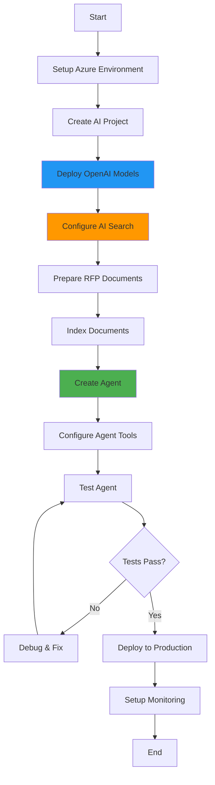

# Creating an RFP Agent: Step-by-Step Guide

## Table of Contents
- [Prerequisites](#prerequisites)
- [Architecture Overview](#architecture-overview)
- [Step 1: Azure Environment Setup](#step-1-azure-environment-setup)
- [Step 2: Document Preparation](#step-2-document-preparation)
- [Step 3: Azure AI Search Configuration](#step-3-azure-ai-search-configuration)
- [Step 4: Agent Creation](#step-4-agent-creation)
- [Step 5: Agent Configuration](#step-5-agent-configuration)
- [Step 6: Testing the Agent](#step-6-testing-the-agent)
- [Step 7: Optimization](#step-7-optimization)
- [Best Practices](#best-practices)
- [Troubleshooting](#troubleshooting)

## Prerequisites

Before creating an RFP Agent, ensure you have:

### Azure Resources
- ✅ **Azure Subscription** with appropriate permissions
- ✅ **Azure AI Project** created and configured
- ✅ **Azure OpenAI Service** with GPT-4 deployment
- ✅ **Azure AI Search** service (Standard tier or higher recommended)
- ✅ **Azure Blob Storage** for document storage
- ✅ **Application Insights** for monitoring (optional but recommended)

### Local Development Environment
- ✅ **Python 3.12** or higher
- ✅ **Azure CLI** installed and configured
- ✅ **Git** for version control
- ✅ **Visual Studio Code** (recommended IDE)

### Required Accounts and Access
- ✅ Azure subscription with Contributor role
- ✅ Azure OpenAI access approval
- ✅ GitHub account (for CI/CD)

## Architecture Overview

The RFP Agent creation process follows this flow:



## Step 1: Azure Environment Setup

### 1.1 Create Resource Group

```bash
# Set variables
RESOURCE_GROUP="rg-rfp-agent-prod"
LOCATION="eastus"
SUBSCRIPTION_ID="your-subscription-id"

# Create resource group
az group create \
  --name $RESOURCE_GROUP \
  --location $LOCATION \
  --subscription $SUBSCRIPTION_ID
```

### 1.2 Create Azure AI Hub

```bash
# Variables
AI_HUB_NAME="ai-hub-rfp-agent"
STORAGE_ACCOUNT="storfpagent"
KEY_VAULT="kv-rfp-agent"
APP_INSIGHTS="appi-rfp-agent"

# Create AI Hub
az ml workspace create \
  --kind hub \
  --resource-group $RESOURCE_GROUP \
  --name $AI_HUB_NAME \
  --storage-account $STORAGE_ACCOUNT \
  --key-vault $KEY_VAULT \
  --application-insights $APP_INSIGHTS \
  --location $LOCATION
```

### 1.3 Create Azure AI Project

```bash
# Variables
AI_PROJECT_NAME="rfp-agent-project"

# Create AI Project
az ml workspace create \
  --kind project \
  --resource-group $RESOURCE_GROUP \
  --name $AI_PROJECT_NAME \
  --hub-id "/subscriptions/$SUBSCRIPTION_ID/resourceGroups/$RESOURCE_GROUP/providers/Microsoft.MachineLearningServices/workspaces/$AI_HUB_NAME" \
  --location $LOCATION
```

### 1.4 Deploy Azure OpenAI Models

```bash
# Create Azure OpenAI resource
OPENAI_NAME="openai-rfp-agent"

az cognitiveservices account create \
  --name $OPENAI_NAME \
  --resource-group $RESOURCE_GROUP \
  --location $LOCATION \
  --kind OpenAI \
  --sku S0

# Deploy GPT-4 model
az cognitiveservices account deployment create \
  --name $OPENAI_NAME \
  --resource-group $RESOURCE_GROUP \
  --deployment-name gpt-4 \
  --model-name gpt-4 \
  --model-version "turbo-2024-04-09" \
  --model-format OpenAI \
  --sku-capacity 10 \
  --sku-name "Standard"

# Deploy embedding model
az cognitiveservices account deployment create \
  --name $OPENAI_NAME \
  --resource-group $RESOURCE_GROUP \
  --deployment-name text-embedding-ada-002 \
  --model-name text-embedding-ada-002 \
  --model-version "2" \
  --model-format OpenAI \
  --sku-capacity 10 \
  --sku-name "Standard"
```

### 1.5 Create Azure AI Search

```bash
# Variables
SEARCH_NAME="search-rfp-agent"

# Create Azure AI Search service
az search service create \
  --name $SEARCH_NAME \
  --resource-group $RESOURCE_GROUP \
  --location $LOCATION \
  --sku Standard \
  --partition-count 1 \
  --replica-count 1

# Get admin key
SEARCH_ADMIN_KEY=$(az search admin-key show \
  --service-name $SEARCH_NAME \
  --resource-group $RESOURCE_GROUP \
  --query primaryKey -o tsv)
```

### 1.6 Create Azure Storage Account

```bash
# Create storage account for documents
az storage account create \
  --name $STORAGE_ACCOUNT \
  --resource-group $RESOURCE_GROUP \
  --location $LOCATION \
  --sku Standard_LRS \
  --kind StorageV2

# Create container for RFP documents
az storage container create \
  --name rfp-documents \
  --account-name $STORAGE_ACCOUNT \
  --auth-mode login
```

## Step 2: Document Preparation

### 2.1 Organize RFP Documents

Create a structured folder hierarchy:

```
rfp-documents/
├── virginia-railway/
│   ├── rfp-main.pdf
│   ├── technical-specs.pdf
│   └── appendices/
├── fiber-optic/
│   ├── requirements.pdf
│   └── diagrams/
└── construction-management/
    ├── scope.pdf
    └── deliverables.pdf
```

### 2.2 Document Format Requirements

Ensure documents meet these criteria:
- **Supported formats**: PDF, DOCX, TXT, MD
- **File size**: < 50MB per file
- **Character encoding**: UTF-8
- **Clean formatting**: Remove scanned images without OCR

### 2.3 Create Evaluation Dataset

Create `datarfp.jsonl` with evaluation data:

```jsonl
{"query":"what are the best practices from Virginia Railway Express project?", "context":"Summary on Railway express best practices", "response":"...", "ground_truth": "..."}
{"query":"what are primary duties of a construction manager?", "context":"Summary on duties of construction manager", "response":"...", "ground_truth": "..."}
{"query":"what are the best practices for Fiber Optic Construction?", "context":"summary of Fiber optic construction", "response":"...", "ground_truth": "..."}
```

### 2.4 Upload Documents to Azure Storage

```bash
# Upload documents
az storage blob upload-batch \
  --destination rfp-documents \
  --source ./rfp-documents \
  --account-name $STORAGE_ACCOUNT \
  --auth-mode login
```

## Step 3: Azure AI Search Configuration

### 3.1 Create Search Index with Vector Support

Create `search-index-definition.json`:

```json
{
  "name": "rfp-documents-index",
  "fields": [
    {
      "name": "id",
      "type": "Edm.String",
      "key": true,
      "searchable": false,
      "filterable": false,
      "sortable": false,
      "facetable": false
    },
    {
      "name": "content",
      "type": "Edm.String",
      "searchable": true,
      "filterable": false,
      "sortable": false,
      "facetable": false,
      "analyzer": "en.microsoft"
    },
    {
      "name": "content_vector",
      "type": "Collection(Edm.Single)",
      "searchable": true,
      "filterable": false,
      "sortable": false,
      "facetable": false,
      "dimensions": 1536,
      "vectorSearchProfile": "vector-profile"
    },
    {
      "name": "title",
      "type": "Edm.String",
      "searchable": true,
      "filterable": true,
      "sortable": true,
      "facetable": false
    },
    {
      "name": "category",
      "type": "Edm.String",
      "searchable": true,
      "filterable": true,
      "sortable": true,
      "facetable": true
    },
    {
      "name": "file_path",
      "type": "Edm.String",
      "searchable": false,
      "filterable": true,
      "sortable": false,
      "facetable": false
    },
    {
      "name": "metadata",
      "type": "Edm.String",
      "searchable": false,
      "filterable": false,
      "sortable": false,
      "facetable": false
    },
    {
      "name": "last_modified",
      "type": "Edm.DateTimeOffset",
      "searchable": false,
      "filterable": true,
      "sortable": true,
      "facetable": false
    }
  ],
  "vectorSearch": {
    "algorithms": [
      {
        "name": "hnsw-algorithm",
        "kind": "hnsw",
        "hnswParameters": {
          "m": 4,
          "efConstruction": 400,
          "efSearch": 500,
          "metric": "cosine"
        }
      }
    ],
    "profiles": [
      {
        "name": "vector-profile",
        "algorithm": "hnsw-algorithm"
      }
    ]
  },
  "semantic": {
    "configurations": [
      {
        "name": "semantic-config",
        "prioritizedFields": {
          "titleField": {
            "fieldName": "title"
          },
          "prioritizedContentFields": [
            {
              "fieldName": "content"
            }
          ],
          "prioritizedKeywordsFields": [
            {
              "fieldName": "category"
            }
          ]
        }
      }
    ]
  }
}
```

### 3.2 Create the Index

```bash
# Create index
curl -X PUT \
  "https://$SEARCH_NAME.search.windows.net/indexes/rfp-documents-index?api-version=2023-11-01" \
  -H "Content-Type: application/json" \
  -H "api-key: $SEARCH_ADMIN_KEY" \
  -d @search-index-definition.json
```

### 3.3 Create Indexer for Automatic Updates

Create `indexer-definition.json`:

```json
{
  "name": "rfp-indexer",
  "dataSourceName": "rfp-documents-datasource",
  "targetIndexName": "rfp-documents-index",
  "schedule": {
    "interval": "PT1H"
  },
  "parameters": {
    "maxFailedItems": 10,
    "maxFailedItemsPerBatch": 5,
    "configuration": {
      "dataToExtract": "contentAndMetadata",
      "parsingMode": "default",
      "imageAction": "generateNormalizedImages"
    }
  },
  "fieldMappings": [
    {
      "sourceFieldName": "metadata_storage_path",
      "targetFieldName": "id",
      "mappingFunction": {
        "name": "base64Encode"
      }
    },
    {
      "sourceFieldName": "metadata_storage_name",
      "targetFieldName": "title"
    },
    {
      "sourceFieldName": "metadata_storage_path",
      "targetFieldName": "file_path"
    },
    {
      "sourceFieldName": "metadata_storage_last_modified",
      "targetFieldName": "last_modified"
    }
  ]
}
```

## Step 4: Agent Creation

### 4.1 Install Required Packages

```bash
# Create virtual environment
python -m venv venv
source venv/bin/activate  # On Windows: venv\Scripts\activate

# Install dependencies
pip install -r requirements.txt
```

### 4.2 Configure Environment Variables

Create `.env` file:

```env
# Azure AI Project Configuration
AZURE_AI_PROJECT=https://your-project.api.azureml.ms
AZURE_AI_PROJECT_ENDPOINT=https://your-project.api.azureml.ms
AZURE_RESOURCE_GROUP=rg-rfp-agent-prod

# Azure OpenAI Configuration
AZURE_OPENAI_KEY=your-openai-key
AZURE_OPENAI_ENDPOINT=https://openai-rfp-agent.openai.azure.com
AZURE_OPENAI_DEPLOYMENT=gpt-4
AZURE_OPENAI_CHAT_DEPLOYMENT_NAME=gpt-4
AZURE_OPENAI_API_VERSION=2024-02-15-preview
AZURE_OPENAI_RESPONSES_DEPLOYMENT_NAME=gpt-4

# Azure AI Model Configuration
AZURE_AI_MODEL_DEPLOYMENT_NAME=gpt-4

# Azure AI Search Configuration
AZURE_AI_SEARCH_INDEX_NAME=rfp-documents-index

# Agent Configuration
AGENT_NAME=rfpagent
```

### 4.3 Create Agent Script

Create `create_rfp_agent.py`:

```python
"""
Script to create an RFP Agent with Azure AI Agent Framework
"""
import os
from azure.identity import DefaultAzureCredential
from azure.ai.projects import AIProjectClient
from dotenv import load_dotenv

# Load environment variables
load_dotenv()

def create_rfp_agent():
    """Create and configure the RFP Agent"""
    
    # Get configuration
    endpoint = os.getenv("AZURE_AI_PROJECT")
    search_index = os.getenv("AZURE_AI_SEARCH_INDEX_NAME")
    
    # Initialize project client
    project_client = AIProjectClient(
        endpoint=endpoint,
        credential=DefaultAzureCredential(),
    )
    
    # Define agent configuration
    agent_config = {
        "name": "rfpagent",
        "instructions": """You are an expert RFP (Request for Proposal) analyst with deep knowledge of construction projects, 
        railway systems, and fiber optic infrastructure. Your role is to:

        1. Analyze RFP documents thoroughly and provide accurate information
        2. Extract key requirements, timelines, and deliverables
        3. Summarize best practices from similar projects
        4. Provide context-aware responses based on the document content
        5. Always cite sources from the RFP documents

        Guidelines:
        - Be precise and factual in your responses
        - Always reference specific sections of RFP documents when applicable
        - If information is not in the documents, clearly state that
        - Use professional language appropriate for business contexts
        - Organize responses in a clear, structured format
        - Highlight critical dates, budgets, and compliance requirements
        """,
        "model": "gpt-4",
        "tools": [
            {
                "type": "file_search",
                "file_search": {
                    "max_num_results": 10
                }
            }
        ],
        "tool_resources": {
            "file_search": {
                "vector_stores": [
                    {
                        "name": "rfp-documents-store",
                        "file_ids": []  # Will be populated with uploaded files
                    }
                ]
            }
        },
        "temperature": 0.3,  # Lower temperature for more factual responses
        "top_p": 0.95
    }
    
    # Create the agent
    print("Creating RFP Agent...")
    agent = project_client.agents.create(**agent_config)
    
    print(f"✅ Agent created successfully!")
    print(f"   Agent ID: {agent.id}")
    print(f"   Agent Name: {agent.name}")
    print(f"   Model: {agent.model}")
    
    return agent

if __name__ == "__main__":
    agent = create_rfp_agent()
```

### 4.4 Run Agent Creation

```bash
# Create the agent
python create_rfp_agent.py
```

## Step 5: Agent Configuration

### 5.1 Upload Documents to Agent's Vector Store

Create `upload_documents.py`:

```python
"""
Upload RFP documents to the agent's vector store
"""
import os
from azure.identity import DefaultAzureCredential
from azure.ai.projects import AIProjectClient
from dotenv import load_dotenv

load_dotenv()

def upload_documents_to_agent(agent_name: str, document_paths: list):
    """Upload documents to agent's vector store"""
    
    endpoint = os.getenv("AZURE_AI_PROJECT")
    
    project_client = AIProjectClient(
        endpoint=endpoint,
        credential=DefaultAzureCredential(),
    )
    
    # Get the agent
    agent = project_client.agents.get(agent_name=agent_name)
    print(f"Found agent: {agent.name}")
    
    # Upload files
    file_ids = []
    for doc_path in document_paths:
        print(f"Uploading {doc_path}...")
        with open(doc_path, "rb") as f:
            file = project_client.agents.upload_file(
                file=f,
                purpose="assistants"
            )
            file_ids.append(file.id)
            print(f"  ✅ Uploaded: {file.id}")
    
    # Update agent's vector store
    vector_store = project_client.agents.create_vector_store(
        name="rfp-documents-store",
        file_ids=file_ids
    )
    
    # Update agent with new vector store
    project_client.agents.update(
        agent_id=agent.id,
        tool_resources={
            "file_search": {
                "vector_store_ids": [vector_store.id]
            }
        }
    )
    
    print(f"\n✅ Uploaded {len(file_ids)} documents to vector store")
    print(f"   Vector Store ID: {vector_store.id}")

if __name__ == "__main__":
    # List your RFP documents
    documents = [
        "./documents/virginia-railway-rfp.pdf",
        "./documents/fiber-optic-specs.pdf",
        "./documents/construction-management.pdf"
    ]
    
    upload_documents_to_agent("rfpagent", documents)
```

### 5.2 Configure Agent Tools

The RFP Agent can use multiple tools:

1. **File Search (RAG)**
   - Searches uploaded RFP documents
   - Returns relevant passages with citations
   - Configurable search parameters

2. **Code Interpreter** (optional)
   - Analyze data from RFP spreadsheets
   - Perform calculations
   - Generate charts

3. **Function Calling** (optional)
   - Custom integrations
   - External API calls
   - Database queries

## Step 6: Testing the Agent

### 6.1 Create Test Script

Use the existing `exagent.py` or create a test script:

```python
"""
Test the RFP Agent
"""
import os
import argparse
from azure.identity import DefaultAzureCredential
from azure.ai.projects import AIProjectClient
from dotenv import load_dotenv

load_dotenv()

def test_agent(agent_name: str, query: str):
    """Test the agent with a query"""
    
    endpoint = os.getenv("AZURE_AI_PROJECT")
    
    project_client = AIProjectClient(
        endpoint=endpoint,
        credential=DefaultAzureCredential(),
    )
    
    # Get the agent
    agent = project_client.agents.get(agent_name=agent_name)
    
    # Get OpenAI client
    openai_client = project_client.get_openai_client()
    
    # Create conversation
    print(f"\n🤖 Query: {query}\n")
    
    response = openai_client.responses.create(
        input=[{"role": "user", "content": query}],
        extra_body={"agent": {"name": agent.name, "type": "agent_reference"}},
    )
    
    # Display response
    for output_item in response.output:
        if hasattr(output_item, 'type') and output_item.type == 'message':
            if hasattr(output_item, 'content') and output_item.content:
                for content_item in output_item.content:
                    if hasattr(content_item, 'text'):
                        print(f"📄 Response:\n{content_item.text.value}\n")
                        
                        # Show citations
                        if hasattr(content_item.text, 'annotations'):
                            print("📚 Citations:")
                            for i, annotation in enumerate(content_item.text.annotations, 1):
                                if hasattr(annotation, 'file_citation'):
                                    citation = annotation.file_citation
                                    print(f"  [{i}] {citation.file_name}: {citation.quote[:100]}...")

if __name__ == "__main__":
    parser = argparse.ArgumentParser()
    parser.add_argument("--agent-name", default="rfpagent")
    parser.add_argument("--query", default="Summarize the Virginia Railway Express project requirements")
    args = parser.parse_args()
    
    test_agent(args.agent_name, args.query)
```

### 6.2 Run Test Queries

```bash
# Test basic query
python test_agent.py \
  --agent-name rfpagent \
  --query "What are the key deliverables for the Virginia Railway Express project?"

# Test another query
python test_agent.py \
  --agent-name rfpagent \
  --query "What are the best practices for fiber optic construction?"
```

### 6.3 Verify Agent Responses

Check that responses:
- ✅ Are accurate and based on uploaded documents
- ✅ Include proper citations
- ✅ Are well-formatted and professional
- ✅ Stay within scope of RFP content
- ✅ Handle edge cases gracefully

## Step 7: Optimization

### 7.1 Tune Agent Parameters

Adjust based on testing results:

```python
# For more creative responses
agent.temperature = 0.7

# For more focused, factual responses
agent.temperature = 0.1

# Adjust search results
file_search_config = {
    "max_num_results": 20,  # Increase for more context
    "ranking_options": {
        "ranker": "semantic",
        "score_threshold": 0.7
    }
}
```

### 7.2 Improve Instructions

Refine agent instructions based on common queries:

```python
instructions = """You are an expert RFP analyst specializing in:
- Construction management projects
- Railway infrastructure development  
- Fiber optic network deployment

When answering questions:
1. Always search documents first before responding
2. Cite specific sections and page numbers
3. Highlight compliance requirements
4. Note important dates and milestones
5. Flag any ambiguities in the RFP

Response format:
- Use bullet points for lists
- Include section headers
- Add citations in [brackets]
- Summarize key points first
"""
```

### 7.3 Add Custom Functions

Create specialized functions for common tasks:

```python
def get_rfp_summary(agent, rfp_name):
    """Get executive summary of an RFP"""
    query = f"""Provide an executive summary of the {rfp_name} RFP including:
    1. Project overview
    2. Key requirements
    3. Submission deadline
    4. Budget range
    5. Critical success factors
    """
    return agent.query(query)

def extract_requirements(agent, category):
    """Extract specific requirement categories"""
    query = f"""List all {category} requirements from the RFP documents,
    organized by priority level."""
    return agent.query(query)
```

## Best Practices

### Document Management
1. **Organize documents logically** by project type or date
2. **Use consistent naming conventions** for easy identification
3. **Keep documents updated** - re-upload when RFPs are revised
4. **Version control** - track document versions in metadata
5. **Regular cleanup** - remove outdated documents

### Agent Configuration
1. **Clear instructions** - Be specific about agent's role and constraints
2. **Appropriate temperature** - Use 0.1-0.3 for factual tasks, 0.7+ for creative
3. **Tool selection** - Only enable tools that are needed
4. **Resource limits** - Set max_tokens and timeout appropriately
5. **Error handling** - Implement retry logic and fallbacks

### Testing and Validation
1. **Create test dataset** - Cover common query types
2. **Establish baselines** - Track response quality over time
3. **Regular evaluation** - Run automated tests weekly
4. **User feedback** - Collect and analyze real usage data
5. **A/B testing** - Compare different configurations

### Security and Compliance
1. **Access control** - Use RBAC for agent access
2. **Data privacy** - Ensure RFPs don't contain PII
3. **Audit logging** - Track all agent interactions
4. **Content filtering** - Enable Azure content safety
5. **Regular audits** - Review agent behavior and outputs

### Performance Optimization
1. **Cache frequent queries** - Reduce latency and costs
2. **Batch operations** - Process multiple queries efficiently
3. **Index optimization** - Tune search parameters
4. **Monitor metrics** - Track response times and token usage
5. **Scale appropriately** - Adjust resources based on demand

## Troubleshooting

### Common Issues

#### Agent returns "No relevant information found"

**Possible causes:**
- Documents not properly indexed
- Search index misconfigured
- Query too vague or specific

**Solutions:**
```bash
# Verify index status
curl -X GET \
  "https://$SEARCH_NAME.search.windows.net/indexes/rfp-documents-index/docs/\$count?api-version=2023-11-01" \
  -H "api-key: $SEARCH_ADMIN_KEY"

# Re-run indexer
curl -X POST \
  "https://$SEARCH_NAME.search.windows.net/indexers/rfp-indexer/run?api-version=2023-11-01" \
  -H "api-key: $SEARCH_ADMIN_KEY"
```

#### Agent responses are too slow

**Possible causes:**
- Large document retrieval
- High token count
- Network latency

**Solutions:**
- Reduce `max_num_results` in file_search
- Use streaming responses
- Enable caching for common queries
- Optimize document chunking

#### Citations are missing or incorrect

**Possible causes:**
- Vector store not properly configured
- Documents not associated with agent
- File search tool disabled

**Solutions:**
- Verify vector store configuration
- Re-upload documents to agent
- Enable file_search tool explicitly

#### Authentication errors

**Possible causes:**
- Expired credentials
- Incorrect permissions
- Wrong endpoint URLs

**Solutions:**
```bash
# Re-authenticate
az login

# Verify permissions
az role assignment list \
  --resource-group $RESOURCE_GROUP \
  --assignee $(az account show --query user.name -o tsv)

# Check endpoint
az ml workspace show \
  --name $AI_PROJECT_NAME \
  --resource-group $RESOURCE_GROUP \
  --query "discovery_url"
```

## Next Steps

After creating your RFP Agent:

1. **Set up CI/CD** - See [CI/CD Deployment Guide](./CICD-DEPLOYMENT-GUIDE.md)
2. **Configure monitoring** - Enable Application Insights tracking
3. **Create evaluation pipeline** - Automate quality testing
4. **Deploy to production** - Follow deployment best practices
5. **Train users** - Provide documentation and examples

## Additional Resources

- [Azure AI Agent Framework Documentation](https://learn.microsoft.com/azure/ai-services/agents/)
- [Azure OpenAI Service Documentation](https://learn.microsoft.com/azure/ai-services/openai/)
- [Azure AI Search Documentation](https://learn.microsoft.com/azure/search/)
- [Best Practices for RAG Applications](https://learn.microsoft.com/azure/ai-services/openai/concepts/rag)

---

**Need help?** Open an issue in the GitHub repository or contact the Azure AI support team.
