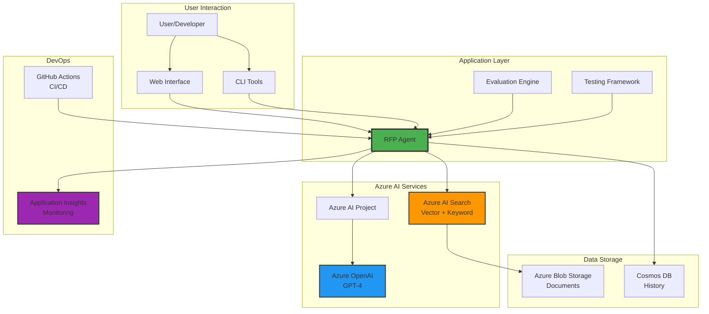
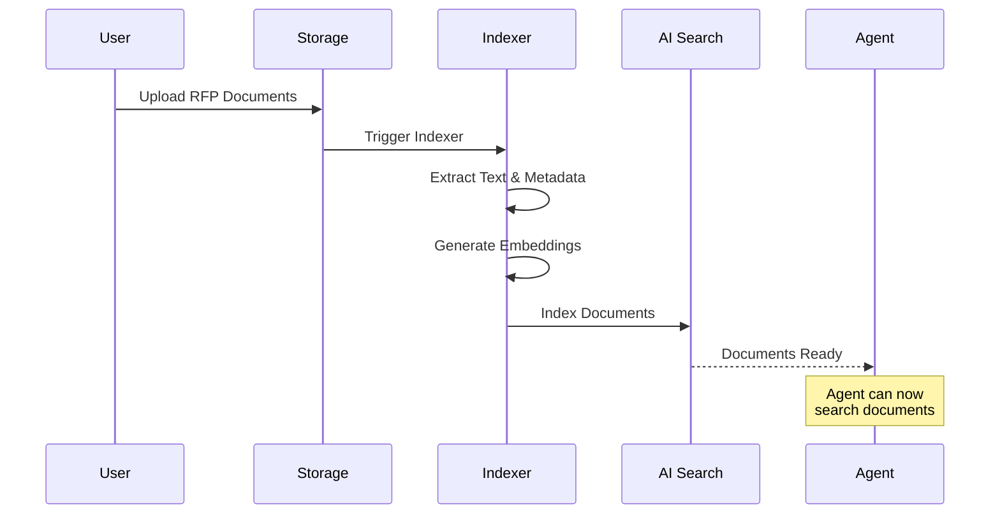
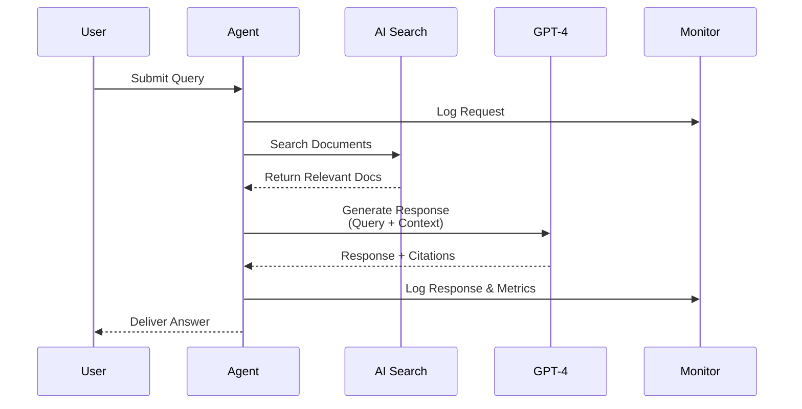
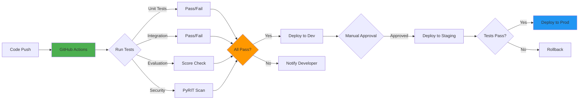
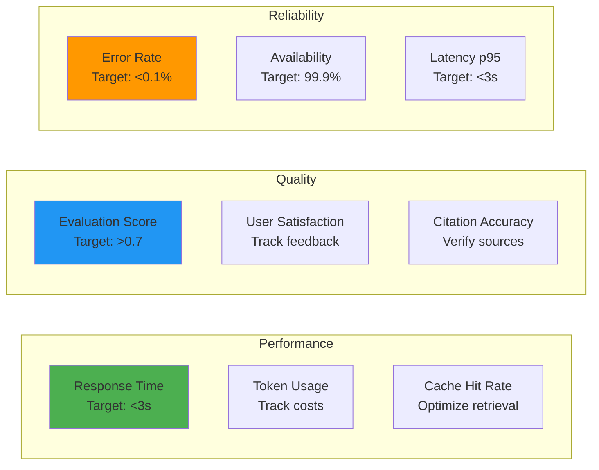

# Quick Reference: RFP Agent System

## System Overview Diagram



## Key Workflows

### 1. Document Processing Flow



### 2. Query & Response Flow



### 3. CI/CD Pipeline Flow



## Component Quick Reference

### Core Components

| Component | Purpose | Key Files |
|-----------|---------|-----------|
| **RFP Agent** | Main AI agent for RFP processing | `exagent.py` |
| **Evaluation** | Quality assessment | `agenteval.py`, `batchevalagent.py` |
| **Red Team** | Security testing | `redteam.py` |
| **CI/CD** | Automation pipeline | `.github/workflows/*.yml` |

### Azure Resources

| Service | Purpose | Config Location |
|---------|---------|-----------------|
| **Azure AI Project** | Agent orchestration | `AZURE_AI_PROJECT` env var |
| **Azure OpenAI** | LLM inference | `AZURE_OPENAI_*` env vars |
| **Azure AI Search** | Document retrieval | `AZURE_AI_SEARCH_INDEX_NAME` |
| **Blob Storage** | Document storage | Azure Portal |
| **App Insights** | Monitoring | Auto-configured |

## Common Commands

### Local Development

```bash
# Setup environment
python -m venv venv
source venv/bin/activate  # Windows: venv\Scripts\activate
pip install -r requirements.txt

# Configure credentials
az login
cp .env.example .env
# Edit .env with your values

# Run agent
python exagent.py \
  --resource-group "your-rg" \
  --project "your-project" \
  --agent-name "rfpagent"

# Run evaluation
python agenteval.py \
  --resource-group "your-rg" \
  --project "your-project" \
  --agent-name "rfpagent"

# Run security tests
python redteam.py \
  --resource-group "your-rg" \
  --project "your-project" \
  --agent-name "rfpagent"
```

### Azure Setup

```bash
# Create resource group
az group create \
  --name rg-rfp-agent \
  --location eastus

# Create AI Hub
az ml workspace create \
  --kind hub \
  --resource-group rg-rfp-agent \
  --name ai-hub-rfp

# Create AI Project
az ml workspace create \
  --kind project \
  --resource-group rg-rfp-agent \
  --name rfp-agent-project \
  --hub-id <hub-resource-id>

# Create OpenAI resource
az cognitiveservices account create \
  --name openai-rfp-agent \
  --resource-group rg-rfp-agent \
  --kind OpenAI \
  --sku S0 \
  --location eastus
```

### GitHub Actions

```bash
# Trigger workflow manually
gh workflow run "Agent Consumption - Single Environment"

# View workflow runs
gh run list --workflow="Agent Consumption - Single Environment"

# View logs
gh run view <run-id> --log
```

## Environment Variables Reference

### Required Variables

```bash
# Azure AI Project
AZURE_AI_PROJECT=https://your-project.api.azureml.ms
AZURE_AI_PROJECT_ENDPOINT=https://your-project.api.azureml.ms
AZURE_RESOURCE_GROUP=your-resource-group

# Azure OpenAI
AZURE_OPENAI_KEY=your-key
AZURE_OPENAI_ENDPOINT=https://your-endpoint.openai.azure.com
AZURE_OPENAI_DEPLOYMENT=gpt-4
AZURE_OPENAI_CHAT_DEPLOYMENT_NAME=gpt-4
AZURE_OPENAI_API_VERSION=2024-02-15-preview
AZURE_OPENAI_RESPONSES_DEPLOYMENT_NAME=gpt-4

# Model Configuration
AZURE_AI_MODEL_DEPLOYMENT_NAME=gpt-4

# Search Configuration
AZURE_AI_SEARCH_INDEX_NAME=rfp-documents-index

# Agent Configuration
AGENT_NAME=rfpagent
```

## Troubleshooting Quick Guide

### Common Issues

| Issue | Solution |
|-------|----------|
| **Authentication failed** | Run `az login` and verify credentials |
| **Agent not found** | Check `AGENT_NAME` environment variable |
| **No search results** | Verify index name and document upload |
| **Slow responses** | Check OpenAI quota and deployment capacity |
| **CI/CD failures** | Review GitHub Actions logs and secrets |

### Health Check Commands

```bash
# Check Azure login status
az account show

# Test agent endpoint
python -c "
from azure.identity import DefaultAzureCredential
from azure.ai.projects import AIProjectClient
import os
client = AIProjectClient(
    endpoint=os.getenv('AZURE_AI_PROJECT'),
    credential=DefaultAzureCredential()
)
print('✅ Connection successful')
"

# Verify search index
curl -X GET \
  "https://your-search.search.windows.net/indexes/rfp-documents-index?api-version=2023-11-01" \
  -H "api-key: your-key"
```

## Monitoring Dashboards

### Key Metrics to Track



### Application Insights Queries

```kusto
// Average response time by agent
customMetrics
| where name == "agent.response_time"
| summarize avg(value) by tostring(customDimensions.agent)
| order by avg_value desc

// Error rate over time
requests
| where success == false
| summarize ErrorCount = count() by bin(timestamp, 1h)
| render timechart

// Token usage by operation
customMetrics
| where name == "agent.tokens_used"
| summarize TotalTokens = sum(value) by bin(timestamp, 1d)
| render timechart
```

## Quick Start Checklist

- [ ] Clone repository
- [ ] Install Python 3.12+
- [ ] Install dependencies (`pip install -r requirements.txt`)
- [ ] Configure Azure CLI (`az login`)
- [ ] Create Azure resources (AI Project, OpenAI, Search)
- [ ] Set environment variables (`.env` file)
- [ ] Upload RFP documents to storage
- [ ] Create search index
- [ ] Create RFP agent
- [ ] Test agent locally
- [ ] Configure GitHub secrets
- [ ] Set up CI/CD workflows
- [ ] Deploy to dev environment
- [ ] Run evaluation tests
- [ ] Deploy to production

## Next Steps

1. **Read the full documentation**:
   - [Architecture Guide](./RFP-AGENT-ARCHITECTURE.md)
   - [Development Guide](./CREATING-RFP-AGENT.md)
   - [CI/CD Guide](./CICD-DEPLOYMENT-GUIDE.md)

2. **Set up your environment**:
   - Follow the installation steps
   - Configure Azure resources
   - Set up local development

3. **Deploy your first agent**:
   - Create an RFP agent
   - Upload documents
   - Test and evaluate

4. **Automate with CI/CD**:
   - Configure GitHub Actions
   - Set up multi-environment deployment
   - Enable monitoring

---

**Need Help?** 
- 📖 [Full Documentation](../README.md)
- 🐛 [Report Issues](https://github.com/balakreshnan/TechconnectFY26Hackfest/issues)
- 💬 Contact the development team
