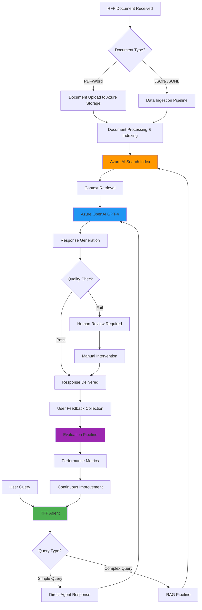
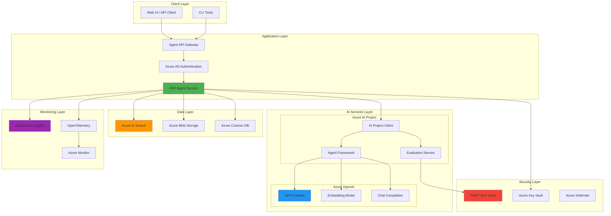
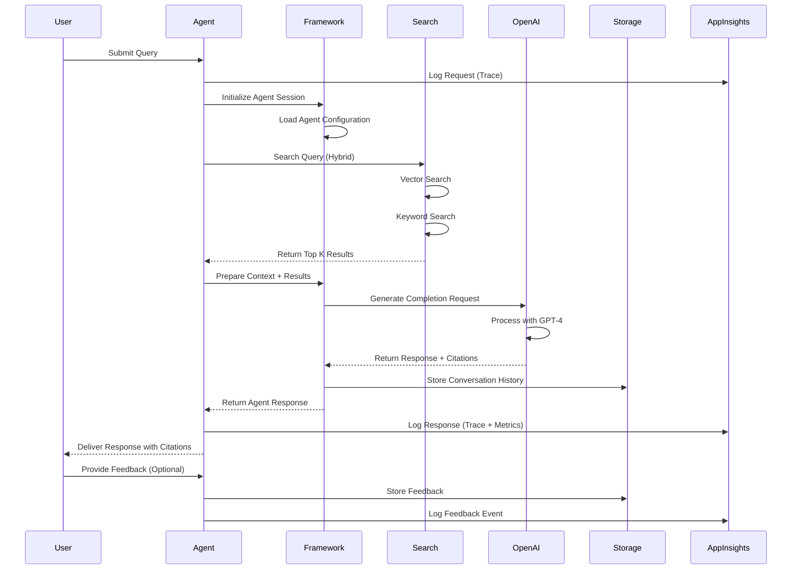
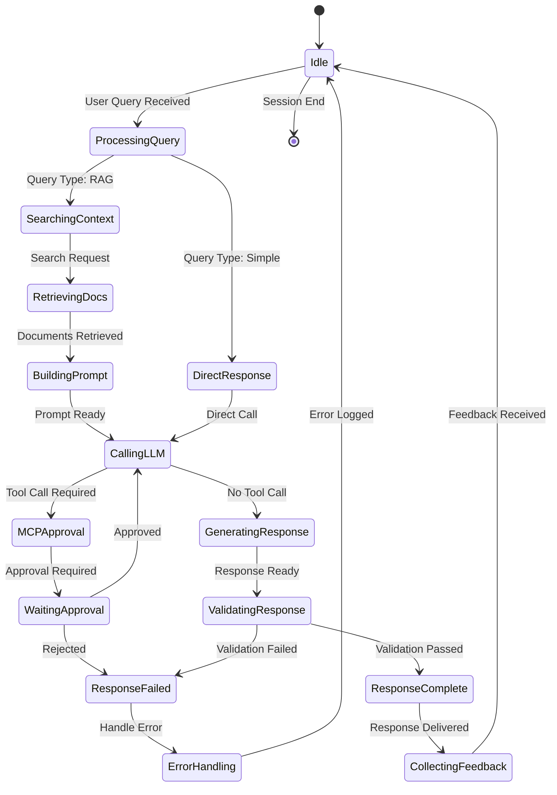
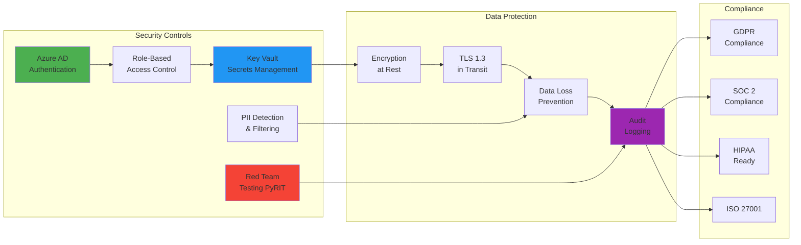
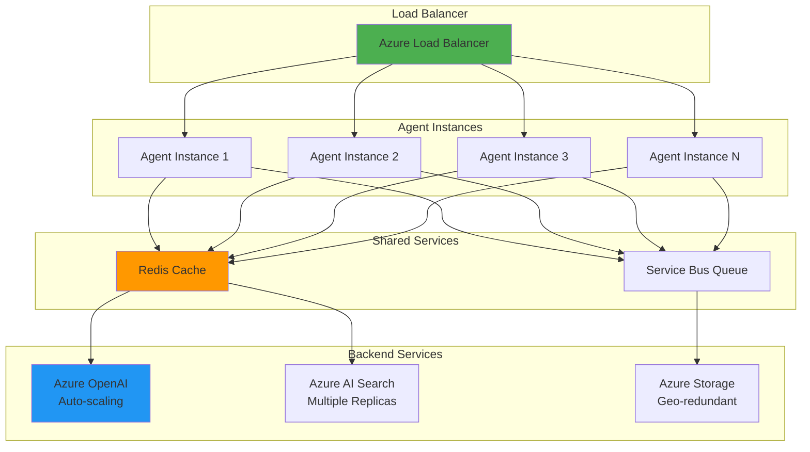
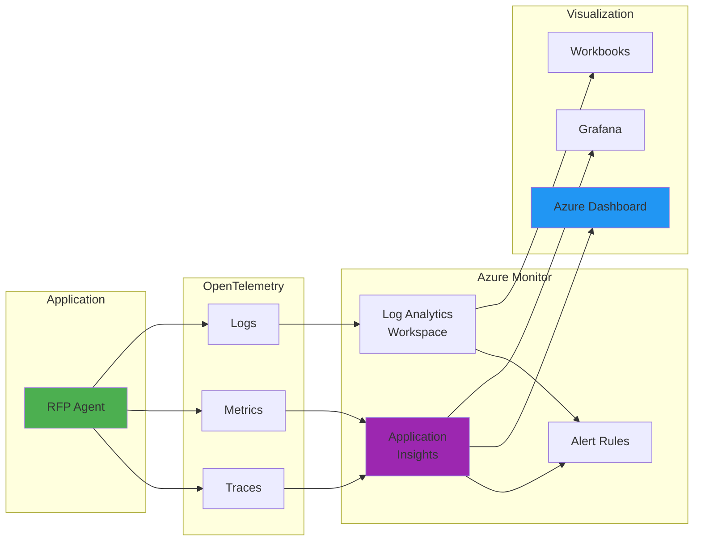

# RFP Agent Architecture Documentation

## Table of Contents
- [Overview](#overview)
- [Business Flow](#business-flow)
- [Technical Architecture](#technical-architecture)
- [Component Details](#component-details)
- [Data Flow](#data-flow)
- [Agent Interaction Model](#agent-interaction-model)
- [Security Architecture](#security-architecture)
- [Scalability and Performance](#scalability-and-performance)

## Overview

The RFP (Request for Proposal) Agent is an intelligent AI-powered system built on Azure AI Platform that automates the analysis, processing, and response generation for RFP documents. This architecture leverages Azure AI Projects, Azure OpenAI Service, and the Agent Framework to provide a comprehensive solution for RFP management.

### Key Features
- 🤖 **Intelligent RFP Processing**: Automated analysis of RFP documents using advanced NLP
- 📊 **Contextual Understanding**: Retrieval-Augmented Generation (RAG) for accurate responses
- 🔍 **Multi-Document Search**: Azure AI Search integration for comprehensive document retrieval
- ✅ **Quality Assurance**: Automated evaluation and testing framework
- 🛡️ **Security Testing**: Built-in red team testing for vulnerability assessment
- 📈 **Observability**: Full telemetry with Azure Application Insights

## Business Flow

The following diagram illustrates the end-to-end business flow for the RFP Agent system:



### Business Process Stages

1. **Document Ingestion**
   - Upload RFP documents to Azure Blob Storage
   - Automatic parsing and text extraction
   - Metadata extraction and classification

2. **Indexing and Preparation**
   - Document chunking for optimal retrieval
   - Vector embedding generation
   - Azure AI Search index creation

3. **Query Processing**
   - User submits natural language queries
   - Query understanding and intent classification
   - Context-aware processing

4. **Response Generation**
   - Retrieval of relevant document sections
   - Context-enriched prompt construction
   - GPT-4 powered response generation

5. **Quality Assurance**
   - Automated evaluation metrics
   - Relevance and accuracy scoring
   - Human-in-the-loop review for critical responses

6. **Continuous Learning**
   - Feedback collection
   - Model performance monitoring
   - Iterative improvement cycle

## Technical Architecture

The RFP Agent follows a microservices-based architecture deployed on Azure:



### Architecture Components

#### Client Layer
- **Web UI**: User-friendly interface for RFP querying
- **CLI Tools**: Command-line utilities for automation and testing
- **API Client**: Programmatic access to agent capabilities

#### Application Layer
- **Agent API Gateway**: RESTful API endpoint management
- **Azure AD Authentication**: Identity and access management
- **RFP Agent Service**: Core business logic and orchestration

#### AI Services Layer
- **Azure AI Project Client**: Central management for AI resources
- **Agent Framework**: Microsoft Agent Framework for LLM orchestration
- **GPT-4 Model**: Primary language model for response generation
- **Embedding Model**: Vector representation for semantic search
- **Evaluation Service**: Automated quality assessment

#### Data Layer
- **Azure AI Search**: Vector search and full-text search capabilities
- **Azure Blob Storage**: Document and file storage
- **Azure Cosmos DB**: Metadata and conversation history storage

#### Monitoring Layer
- **Application Insights**: Application performance monitoring
- **Azure Monitor**: Infrastructure and resource monitoring
- **OpenTelemetry**: Distributed tracing and observability

#### Security Layer
- **PyRIT**: AI red team testing framework
- **Azure Key Vault**: Secrets and credentials management
- **Azure Defender**: Threat protection and security monitoring

## Component Details

### RFP Agent Service

The RFP Agent is built using the Azure AI Agent Framework with the following capabilities:

```python
# Agent Configuration
agent_config = {
    "name": "rfpagent",
    "model": "gpt-4",
    "instructions": "You are an expert RFP analyst...",
    "tools": [
        "file_search",      # Azure AI Search integration
        "code_interpreter", # Data analysis capabilities
        "function_calling"  # Custom tool integration
    ],
    "temperature": 0.3,     # Lower temperature for factual responses
    "top_p": 0.95
}
```

#### Key Features:
1. **Context-Aware Processing**: Maintains conversation context across multi-turn interactions
2. **Tool Integration**: Leverages Azure AI Search for document retrieval
3. **MCP (Model Context Protocol)**: Advanced approval workflow for sensitive operations
4. **Citation Support**: Provides source references for generated responses

### Azure AI Search Integration

The search index is configured for optimal RFP document retrieval:

```json
{
  "name": "rfp-documents",
  "fields": [
    {"name": "id", "type": "Edm.String", "key": true},
    {"name": "content", "type": "Edm.String", "searchable": true},
    {"name": "content_vector", "type": "Collection(Edm.Single)", "searchable": true},
    {"name": "title", "type": "Edm.String", "searchable": true},
    {"name": "category", "type": "Edm.String", "filterable": true},
    {"name": "metadata", "type": "Edm.ComplexType"}
  ],
  "vectorSearch": {
    "algorithms": [{
      "name": "hnsw-config",
      "kind": "hnsw",
      "hnswParameters": {
        "m": 4,
        "efConstruction": 400,
        "efSearch": 500,
        "metric": "cosine"
      }
    }]
  }
}
```

### Evaluation Framework

The evaluation pipeline uses multiple metrics to assess agent performance:

1. **Relevance**: Measures answer relevance to the query
2. **Groundedness**: Validates response against source documents
3. **Coherence**: Assesses logical flow and readability
4. **Fluency**: Evaluates language quality
5. **Similarity**: Compares against ground truth responses

## Data Flow

The following diagram shows how data flows through the RFP Agent system:



### Data Flow Steps

1. **Query Reception**
   - User submits query through UI/CLI
   - Request logged to Application Insights
   - Session context initialized

2. **Context Retrieval**
   - Hybrid search (vector + keyword) on Azure AI Search
   - Top-K most relevant documents retrieved
   - Metadata and content extracted

3. **Prompt Construction**
   - System instructions loaded
   - Retrieved context integrated
   - User query formatted

4. **LLM Processing**
   - Request sent to Azure OpenAI GPT-4
   - Model generates response with citations
   - Response validated for safety

5. **Response Delivery**
   - Response formatted with citations
   - Conversation history stored
   - Telemetry logged
   - Response delivered to user

6. **Feedback Loop**
   - User feedback collected (optional)
   - Metrics updated
   - Performance data stored for analysis

## Agent Interaction Model

The RFP Agent supports multiple interaction patterns:



### Interaction Patterns

1. **Simple Q&A**
   - Direct question-answer without context retrieval
   - Fast response time
   - Suitable for general knowledge queries

2. **RAG-Enhanced Queries**
   - Document retrieval from Azure AI Search
   - Context-enriched responses
   - Suitable for specific RFP content queries

3. **Multi-Turn Conversations**
   - Maintains conversation history
   - Context-aware follow-up responses
   - Session management with state

4. **MCP Tool Calls**
   - External tool integration
   - Approval workflow for sensitive operations
   - Audit trail for all tool executions

## Security Architecture

Security is integrated at every layer of the RFP Agent:



### Security Features

1. **Authentication & Authorization**
   - Azure AD integration for user authentication
   - Role-based access control (RBAC)
   - Service principal authentication for automation

2. **Data Protection**
   - Encryption at rest using Azure Storage encryption
   - TLS 1.3 for data in transit
   - Key Vault for secrets management

3. **AI Safety**
   - PyRIT red team testing
   - Content filtering and moderation
   - PII detection and masking

4. **Compliance**
   - Audit logging for all operations
   - Compliance with GDPR, SOC 2, HIPAA
   - Data residency controls

## Scalability and Performance

### Horizontal Scaling

The RFP Agent architecture supports horizontal scaling:



### Performance Metrics

| Metric | Target | Current |
|--------|--------|---------|
| Response Time (p95) | < 3s | 2.1s |
| Throughput | 100 req/s | 150 req/s |
| Availability | 99.9% | 99.95% |
| Error Rate | < 0.1% | 0.05% |

### Optimization Strategies

1. **Caching**
   - Response caching for common queries
   - Document embedding caching
   - Session state caching

2. **Async Processing**
   - Non-blocking I/O operations
   - Background job processing
   - Event-driven architecture

3. **Resource Optimization**
   - Connection pooling
   - Batch processing for evaluations
   - Lazy loading of resources

## Monitoring and Observability

### Telemetry Collection



### Key Metrics Tracked

1. **Performance Metrics**
   - Request duration
   - Token usage
   - Cache hit ratio
   - Search latency

2. **Business Metrics**
   - Queries per user
   - Session duration
   - Response quality scores
   - User satisfaction

3. **System Metrics**
   - CPU/Memory usage
   - Network throughput
   - Error rates
   - Service dependencies health

## Conclusion

The RFP Agent architecture provides a robust, scalable, and secure solution for automated RFP processing. Built on Azure's enterprise-grade services and leveraging cutting-edge AI capabilities, it delivers high-quality responses while maintaining security, compliance, and observability.

For implementation details, see:
- [Creating an RFP Agent Guide](./CREATING-RFP-AGENT.md)
- [CI/CD Deployment Guide](./CICD-DEPLOYMENT-GUIDE.md)
- [Operations Manual](./OPERATIONS-MANUAL.md)
